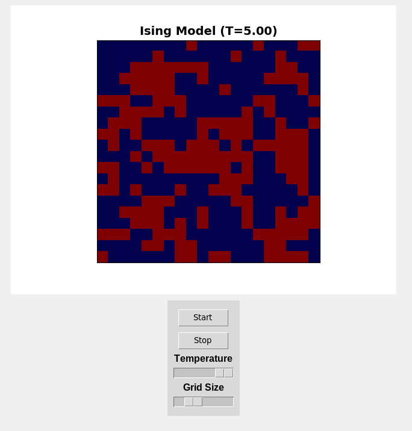

# Ising Model Simulation

## Overview
This project simulates the Ising Model using the Markov Chain Monte Carlo (MCMC) method. It provides both a command-line interface (CLI) and a graphical user interface (GUI) for running simulations.


## Mathematical Formulation
The Ising Model is a mathematical model used in statistical mechanics to describe ferromagnetism. It consists of discrete variables called spins, which can take values $` s_i = \pm 1 `$ and are arranged in a lattice. The Hamiltonian (energy function) of the system is given by:

```math
H = -J \sum_{\langle i,j \rangle} s_i s_j - \mu B \sum_i s_i
```

where:

- $` J `$ is the interaction energy between neighboring spins.
- $` \sum_{\langle i,j \rangle} `$ denotes summation over all neighboring pairs.
- $` \mu B `$ represents the external magnetic field term (which can be set to zero if there is no external field).
- $` s_i, s_j `$ are the spin values at lattice sites $` i `$ and $` j `$.

## Metropolis-Hastings Algorithm

The system evolves using the Metropolis-Hastings algorithm, which follows these steps:

1. Select a random spin $` s_i `$ in the lattice.
2. Compute the change in energy if the spin is flipped:

   ```math
   \Delta H = 2J s_i \sum_{j \in \text{neighbors}} s_j + 2 \mu B s_i
   ```

3. Accept the flip with probability:

   ```math
   P(\text{flip}) = \min(1, e^{-\Delta H / k_B T})
   ```

   where $` k_B `$ is the Boltzmann constant and $` T `$ is the temperature.


This simulation implements these steps to generate configurations and analyze phase transitions in the Ising model.

## Installation
Ensure you have Python installed (>=3.8). Then, clone the repository and install the required dependencies:

```bash
pip install -r requirements.txt
```

## Usage
### CLI Simulation
Run the CLI simulation with optional parameters:

```bash
python examples/cli_simulation.py --temperature 3.0 --steps 3500
```

- `--temperature` (default: `1.0`) sets the simulation temperature.
- `--steps` (default: `1500`) specifies the number of Metropolis-Hastings steps.

#### Example CLI Output


### GUI Simulation
Run the GUI-based simulation:

```bash
python examples/gui_simulation.py
```

The GUI allows for interactive visualization of the Ising model simulation.

#### GUI Preview


## Project Structure
```
ising_model_simulation/
│── examples/        # CLI and GUI simulation scripts
│── ising_model/     # Core Ising Model implementation
│── simulator/       # Simulation logic
│── gui/             # GUI components
│── tests/           # Unit and integration tests
│── res/             # Resources (Pictures and videos) for documentation
│── README.md        # Project documentation
```

## Contributing
Contributions are welcome! Feel free to open issues or submit pull requests.

## License
This project is licensed under the MIT License.
