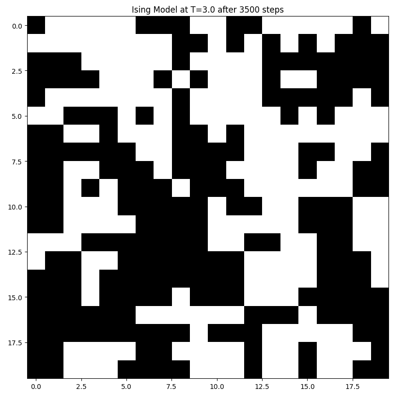

# Ising Model Simulation

## Overview
This project simulates the Ising Model using the Markov Chain Monte Carlo (MCMC) method. It provides both a command-line interface (CLI) and a graphical user interface (GUI) for running simulations.

## Installation
Ensure you have Python installed (>=3.8). Then, clone the repository and install the required dependencies:

```bash
pip install -r requirements.txt
```

## Usage
### CLI Simulation
Run the CLI simulation with optional parameters:

```bash
python examples/cli_simulation.py --temperature 3.0 --steps 3500
```

- `--temperature` (default: `1.0`) sets the simulation temperature.
- `--steps` (default: `1500`) specifies the number of Metropolis-Hastings steps.

#### Example CLI Output


### GUI Simulation
Run the GUI-based simulation:

```bash
python examples/gui_simulation.py
```

The GUI allows for interactive visualization of the Ising model simulation.

#### GUI Preview


## Project Structure
```
ising_model_simulation/
│── examples/        # CLI and GUI simulation scripts
│── ising_model/     # Core Ising Model implementation
│── simulator/       # Simulation logic
│── gui/             # GUI components
│── tests/           # Unit and integration tests
│── res/             # Resources (Pictures and videos) for documentation
│── README.md        # Project documentation
```

## Contributing
Contributions are welcome! Feel free to open issues or submit pull requests.

## License
This project is licensed under the MIT License.

